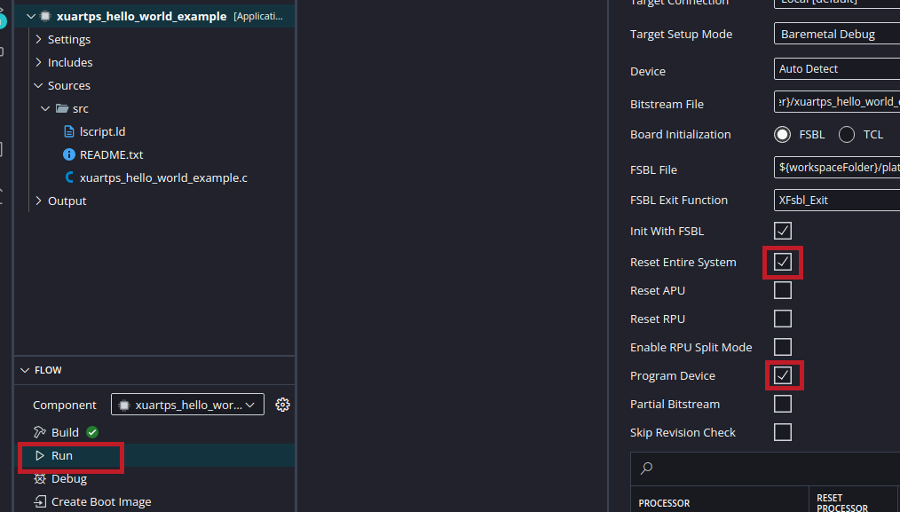
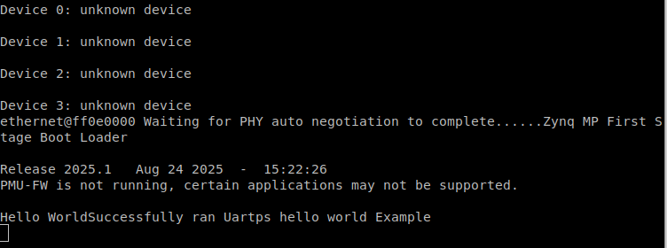
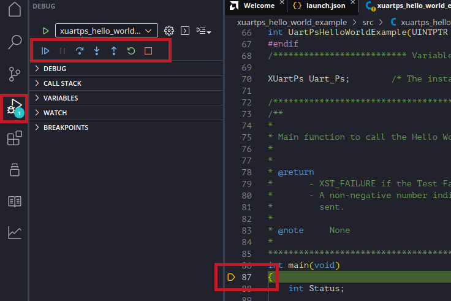

# Software development using Vitis

This page details the steps involved in creating a software application using Vitis, an VS Code-based IDE, to run on the hardware platform created using Vivado. You should be using a Vitis version that matches your Vivado version.

Note: There are slight differences in GUI and options based on the version. The spirit of what is being done remains the same.

## Vitis

Open the Vitis IDE from the start menu or by clicking the desktop icon or from Tools > Launch Vitis IDE from Vivado.

Set a **workspace**. File> Set Workplace. This can be any folder, though it might a good idea to create it under <vivado project path>\\workspace, so that the hardware and software projects are in the same folder.

Create a new platform project. File > New Component > Platform.

Note: It is also possible to start from File > New Component > Platform, which will prompt you to select/create a Platform Project. You can also choose create Application components later, to create applications such as a simple Hello World application.

You will get a new platform project dialog. Enter a **name** for your project and location (or just accept the defaults), and click **Next**.

In the next screen, make sure **Hardware Design** is selected. The click the **Browse** button. A file selector window will open, where you will have to navigate to <vivado project path> and select the **design\_1\_wrapper.xsa** file and click Next.  It will take a few seconds to read the .xsa file. Accept the defaults\*. 

\*OS=standalone, Processor=psu\_cortexa53\_0, Generate boot components (First Stage Boot Loader aka FSBL) checked, etc. It is possible to do a non-FSBL initialisation via .tcl scripts that invoke the debugger, but we will just let it be via FSBL.
If you fancy playing with FreeRTOS (which gives you support for multithreading etc.), you can choose that, though for CEG5203, standalone (a library providing basic functions such as stdin/stdout used by prinft/scanf and some other basic functionalities for 'bare metal' programming) is good enough.

Click **Next** and click **Finish**.

You will now be presented with the workspace. Under the platform project, click on platform.spr. Click on Board Support Package under standalone on psu\_cortexa53\_0. You can now modify BSP settings if need be (though defaults should be fine), such as including various libraries, selecting the drivers to be used for various peripherals, selecting the std\_in and std\_out peripherals (which should both be psu\_uart1), etc.

You can import examples for the various peripherals. For a start, we can run an example program for psu\_uart1, which is the peripheral we will be using for basic input/output (and will interact with the serial terminal/console program, e.g., RealTerm).

In the next screen, select xuartps\_hello\_world\_example. You will now see the application project in the workspace.

Have a look at the main source file, and understand the code.

Now, click build to build the application.

It will prompt you with a dialog box. Select **Always build platform with application** radio button and **Save in workspace preference** button.

Wait for the build to be completed.

Make sure that you connect the micro USB cable to your computer and the board. Make sure that the board is powered on via the adaptor (it is not powered via USB). RealTerm (or another serial terminal program) should be opened and the correct port number should be selected (the lowest numbered among the multiple COM/ttys detected corresponding to the board).

We can run the program by clicking **Run** as shown below (Debug is also ok, if we want debug controls such as single stepping). If you are getting errors (likely during a second run), try running again.

.

For future runs, if your hardware configurations has not been changed, you can uncheck the 'Reset Entire System' and 'Program Device' which may save some time.

If the program ran successfully, you can see something similar to the screenshot below in your serial terminal (console) program such as RealTerm. The formatting could appear a bit different depending on the terminal program and CR/LF settings.

.

You can also click **Debug**, and then the standard VS Code debugging options become available. The screenshot shows the program suspended at the beginning. You can set single step, set breakpoints (double click to the left of the line number), run until breakpoint, step into functions, etc.
It is a good idea to stop using the red stop button before starting a fresh Run/Debug.

.

If you are getting errors such as "Could not find ARM device...", the board is likely not detected - either the board is not powered on, or the cable is not connected, driver is not installed, or you did not allow some firewall warning during installation or first run. Try programming the FPGA using the Hardware Manager in Vivado (below the 'Generate Bitstream' option in the left menu).

## Beyond Hello World : Running AXI Stream FIFO Example program

Go to Board Support Package > Standalone > drivers (similar to how you did for UART), and select the example for axi\_fifo\_mm\_s\_0 as sho. This assumes a loopback connection in the block diagram / design we created in Vivado.

Build, Run and see the results, which should show a success message in the serial terminal.

## Optional Exercise

Simple input/output : Write a simple program in Vitis to read a character from the console and print that character to the console (echo).

Essentially, you sent out a character from RealTerm console to PSU\_UART1 on the Kria board. The C program running on ARM Cortex A53 reads it from the PSU\_UART1 input buffer (using scanf or UART driver functions), and writes it to the PSU\_UART1 output buffer (using printf or UART driver functions). The PSU\_UART1 will send it over to the RealTerm console, which will then display it.
