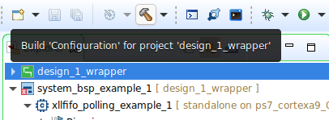

# Modifying the Coprocessor

Once you update your IP using HLS and come back to your main Vivado project, it will show a banner that 'IP Catalog is Out of Date' or 'myip_0 should be upgraded'. If it is the former, click **Rerun** in the IP Status Tab below. If it is the latter, clicking Report IP Status / Show IP Status will open up the IP Status Tab. Either way, after myip_0 is selected, click **Upgrade Selected**.

If the 'IP Status' tab does not appear, make sure that the IP Integrator is selected in the Flow Navigator, and Reports (top menu bar) > Report IP Status.

An IP Upgrade Completed will pop up once the IP is successfully upgraded. When you dismiss the message by clicking OK, it will show up a Generate Output Products window. Click **Generate**. Once the output products are generated, click OK to dismiss the message.  The IP Status will again show that one or more IPs have changed. Click **Rerun **again (the second time is for regenerating reports), but you need not (and won't be able to) click Upgrade Selected this time.

You can check if the IP is updated by following the screenshot below.

Now, you can go ahead and** Generate Bitstream**.

Once the hardware is generated, Export > **Export Hardware**. Don't forget to **Include bitstream**.

For Vitis, you have to do it explicitly by right-clicking on the hardware platform as shown in the figure below. You will then be required to browse to the updated .xsa file, followed by two OKs.

Then build the design_1_wrapper.

The Vitis project doesn't always get updated that properly. If you run into issues, Reset BSP Sources as shown in the figure below, and build the hardware and application projects.

If that doesn't work either, create a new workspace, and then an application project using the new .xsa file. Copy over your C code to the new project.

Don't forget to **program the FPGA again** before running your code (which will be done automatically if the option to Program FPGA is checked in Run Configurations), as the hardware has now changed!

If it still shows the old coprocessor functionality, perhaps you did not repackage the IP properly. If you are sure you did, you might want to try deleting intermediate files in Vivado and regenerating the bitstream.
