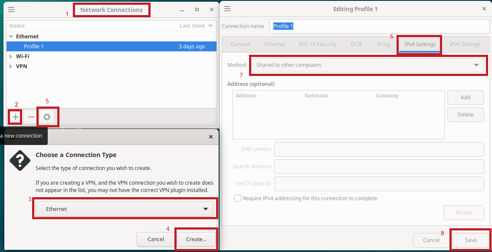
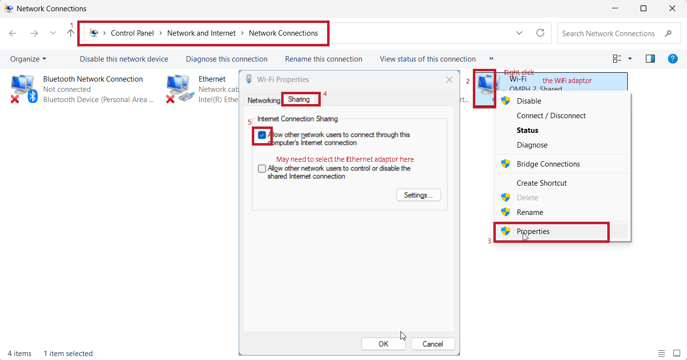

# Pynq and OpenCL on Kria

!!! warning "Follow the Spirit"
    The instructions should be treated as a rough guideline rather than a very comprehensive manual. Figure out on your own how to solve issues, if any.

## Booting Linux

For this part, we will boot Ubuntu Linux on Kria board. 

 AMD/Xilinx *does not* provide a [ready-to-use image for Kria board](https://www.pynq.io/boards.html) yet.

A zipped SD card image is provided [here - version 16_10_2025](https://www.dropbox.com/scl/fi/th7kynsmgxojzxmkh0fav/Ubuntu_Pynq_Kria_CEG5203_16_10_2025.img.zip?rlkey=q3ioj6el6vzrxj9gzw1d70p9x&st=pr2fa0ml&dl=0). The download password is mentioned in the Canvas announcements. Download and unzip the image (.img).

 The following changes were made to the image: 

* Version 12_10_2025 : OpenCV downgraded to 4.10.0.84.
* Version 16_10_2025 : Size of image shrunk to less than 14 GB, which should fit into all 16 GB SD cards.

It is the [official Kria Ubuntu 22.04 image](https://ubuntu.com/download/amd) modified with the following:

* [Pynq](https://github.com/Xilinx/Kria-PYNQ) installed. It does not work out of the box and requires numpy to be downgraded to 1.26.4. 
OpenCV should be downgraded to 4.10.0.84 for it to work with this version of numpy (not sure if it breaks any other package).
* PoCL installed.
* Example programmes for [OpenCL and Pynq](https://github.com/NUS-CEG5203/assignments/tree/main/docs/Assignment_3/code_templates) loaded.

Some familiarity with Linux command line is handy from now on. Some useful commands are
`ls`, `pwd`, `clear`, `nano` (command line text editor), `cp`, `mv`, `rm`, `cat`, `mkdir`, `rmdir`. Read up more about these. Pressing tab will help with autocomplete and that can be very handing when operating from command line.

Use the .img image and flash it to an SD card after plugging the SD card into your laptop’s card reader or the provided card reader. The SD card should be at least 16 GB capacity. Do not just copy over; use an image writer application such as [Raspberry Pi Imager](https://www.raspberrypi.com/software/) (for CHOOSE OS, select the last option, i.e, 'use custom'; ignore the CHOOSE DEVICE option) or [Win32 Disk Imager](https://win32diskimager.org/) or [balena Etcher](https://etcher.balena.io/) or the ones bundled with Linux distributions (e.g., Disk Image Writer in Ubuntu - just right-click on the .img file in file explorer). The contents of the SD card will entirely be erased - make sure you choose the correct device/drive!.

Insert the SD card into the micro SD card slot with the printed side facing up.

Turn it on, and it will boot from SD Card to Ubuntu 22.04. There is a small chance it may not boot due to potential incompatibility between the board firmware and OS version. If this happens, perhaps it is a good idea to change the board to another one with a newer firmware. You can also update the firmware to the latest following the [instructions](https://xilinx-wiki.atlassian.net/wiki/spaces/A/pages/3020685316/Kria+SOM+Boot+Firmware+Update), which requires a direct Ethernet connetion between the board and your laptop, and a static ip set for your laptop Ethernet interface.

Every time before you power off, shut down the OS properly using `sudo shutdown -h now`. Wait until the LEDs next to the fan turns off before removing power.

## Interacting with Linux on Kria

Serial port involved minimal connections to the board, but is not very powerful / flexible. Ethernet has the advantage of not needing USB drive to copy programs/bitstream over, ability to use `apt` and `pip`, and provides a generally much better flexibility and experience than serial. However, setting up Ethernet based communication involves a bit more work.

Another alternative to Ethernet or Serial: If you have an HDMI/DisplayPort monitor, keyboard and mouse: You can connect and operate like a normal computer.

Some notes on how to use Serial and Ethernet are given below.

=== "Serial"

    Use a terminal program and connect to the appropriate COM/tty/serial port as you did in assignment 1, baud rate of 115200. You will see the various boot messages.

    If using Windows on your laptop/PC, RealTerm can be used for this purpose, but it is not great to be used like a conventional high-level terminal, though it is great for low-level debugging. RealTerm shows all characters by default, including non-printable ones, which makes it look messy. In the display tab, change it to ANSI to make it operate like a normal terminal. Even then, it is not great for the purpose. It is suggested to use another terminal program such as the Serial funcionality of [MobaXterm Home Editon](https://mobaxterm.mobatek.net/download.html).

    Eventually, it will throw up a login prompt. Username is _ubuntu_ and password is the same as the one used for downloading the archive.

    If you had not connected to the serial port before the boot is complete, press enter, and it will show the login prompt.

=== "Ethernet"

    
    Use a wired (Ethernet) connection to a router or a laptop having an Ethernet interface / USB-Ethernet adapter.

    To do anything via Ethernet, we need to have a mechanism whereby the Kria board Ethernet interface has a valid IP address. This is generally via DHCP, provided automatically by your router or laptop configured for internet connection sharing via Ethernet. The leasing of IP address is done only after the booting process is more or less complete. 

    If connected to the router, there will be some status page that will list the IP address leases.

    In case of a connection directly to laptop, you will need to share your laptop internet connection via Ethernet. This is easy to accomplish in a few clicks in Windows or Linux GUI; ChatGPT will tell you how - rough idea illustrated in the screenshots below, but there could be differences depending on your specific laptop and OS version. The functionality is slightly finicky in Windows though, sometimes requiring you to unshare and share again.

    === "Linux"
        
    === "Windows"
        

    You can find the IP address from your laptop via `arp -a` from both Windows (Start Menu > cmd, or Start local terminal in MobaXterm) and Linux command line. In Windows, the IP address of the board will typically be 192.168.137.x, where x is between 2 and 254, corresponding to the Interface 192.168.137.1. If the interface looks like 169.x.x.x, it means internet connection sharing is not working. In Linux, the IP address given to the device is typically 10.42.0.x.

    The IP address can be also be found from Kria Linux commandline via a Serial connection, and running `hostname -I` or `ip addr show` or `ip a` or `ifconfig` - for the last 3 commands, look for the inet value corresponding to eth0.

    IP address can also be set statically depending on the use case. In this scenario, IP addresses of both the Kria board and the laptop Ethernet interface will need to be set statically. This provides stable connection settings - IP address will not change; but our ability to use anything that needs internet, such as `apt` and `pip` may be limited.

    You can use an SSH client such as [MobaXterm](https://mobaxterm.mobatek.net/download.html) on Windows or [Muon SSH](https://github.com/devlinx9/muon-ssh) / bash terminal in Linux (`ssh -X ubuntu@<kriaboard_ip_address>`). You can even run GUI-based programs on Kria and have the display forwarded to your laptop (X forwarding).

    Alternatively, you can use the terminal within Jupyter Lab at <kriaboard_ip_address\>:9090/lab via your browser- password to enter the web interface itself is _xilinx_.
    

## OpenCL on Kria

Let us start with an OpenCL on CPU (Cortex A53). The main.cpp file is the same as the one we used with OpenCL on PC/Laptop. Just ensure that the correct platform id and device type are used in the .cpp file. Execute the following.

`cd /home/ubuntu/OpenCLExample` // change to the folder with OpenCL example.

`g++ main.cpp -lOpenCL -o main.out` // compile main.cpp

`./main.out` // run it.

If you want to make minor edits to the .cpp file, you can do so using nano editor via the command `nano main.cpp`.

Make sure that the line containing `#define XCLBIN` is commented out, as uncommenting it will cause the system to crash. It was an attempt to use OpenCL host code with the FPGA (PL) accelerator, which is not working, likely due to version-related issues.

## Pynq on Kria

Pynq framework allows python code to interact with your custom coprocessor connected via AXI DMA (not AXI Stream FIFO).

The example program adds 4 numbers, invoking the coprocessor and prints the sum, sum+1, sum+2, sum+3 (the coprocessor created using the example HLS code from Assignment 2).  

Have a look at the .py code and understand the functionality. It is more or less the same as the C program used with AXI DMA, except that the bitstream is downloaded by the host python code, rather than before the host code is run (which was the case with Assignment 2). This also means a few seconds delay before the computation is started and results are printed.

Pynq requires the .hwh file with the same name as the .bit file, and in the same folder. This is already done for the example in the PynqDMAExample folder.

`sudo -s` // the prompt will change to #. You are now in a root shell.

`source /etc/profile.d/pynq_venv.sh` // activate the virtual environment

`cd /home/ubuntu/PynqDMAExample/` // change to the directory containing the python script

`python3 PynqDMAExample.py` // run it

To have a new .bit and .hwh, first have the .xsa ready. The .xsa can be unzipped using any tool that can deal with .zip (rename it to .zip if necessary). You will then find the .bit and the .hwh (The one we need is the top level .hwh, usually named design_1.hwh; not those named design_1_axi_smc_*.hwh) file. Rename the .hwh file to have the same as the .bit file, except for the extension.

If you have SSH /Jupyter lab access, you can copy these files via MobaXterm/Muon SSH/Jupyter lab UI conveniently.

If not, you will need to do it via a USB drive, instructions given below. 

??? tip "Transferring files using a USB Drive"

    Copy the files to be transferred to a USB drive (not BitLocker-encrypted) from your laptop. Plug it into one of the USB ports.

    You can then copy the file (say, mybitstream.bit) from `/media/ubuntu/<label>` to your working directory (say, `/home/ubuntu/PynqDMAExample`) via the command

    `cp /media/ubuntu/<label>/mybitstream.bit /home/ubuntu/PynqDMAExample`.

    Do the same for the `.hwh` file.

    You can find the `<label>` corresponding to your USB drive by pressing tab and looking at autocomplete options after typing `cp /media/ubuntu/`.

    
    If `/media/ubuntu/<label>` does not exist, it means your drive was not automounted. In this case, you need to mount it manually. Follow the steps below.

    First, find out the partition number of your USB drive. This can be done via the command `lsblk`. You will see something like

    `sdb` 
    `└─sdb1`

    Here, `sdb` is the block device name and `sdb1` is the partition number. If it is different, make the changes are appropriate for the commands below. For now, we use a label/mountpoint `usbdrive`.

    `sudo mkdir -p /media/ubuntu/usbdrive`  // to create a directory to mount the drive, if it does not exist.

    `sudo mount /dev/sdb1 /media/ubuntu/usbdrive/`  // mount it. Will be read-only for the user ubuntu. This has to done with each unmounting or reboot. An alternative is an appropriate entry in /etc/fstab.

    `cp /media/ubuntu/usbdrive/mybitstream.bit /home/ubuntu/PynqDMAExample`. // to copy the bitstream over to our working directory. 
    
    Do the same for the `.hwh` file.

    Before removing the USB drive, it is a very good idea to unmount it via 
    
    `sudo umount /media/ubuntu/usbdrive`.

    If you made changes to your file directory on the Kria, in order to copy back to the USB drive, the drive should be mounted with write permissions for the user Ubuntu. It is easy to figure out how to do this with a bit of Googling.

If you wish to make substantial changes to the .cpp file for OpenCL, you can also edit on the laptop and copy it using one of the methods mentioned above.
